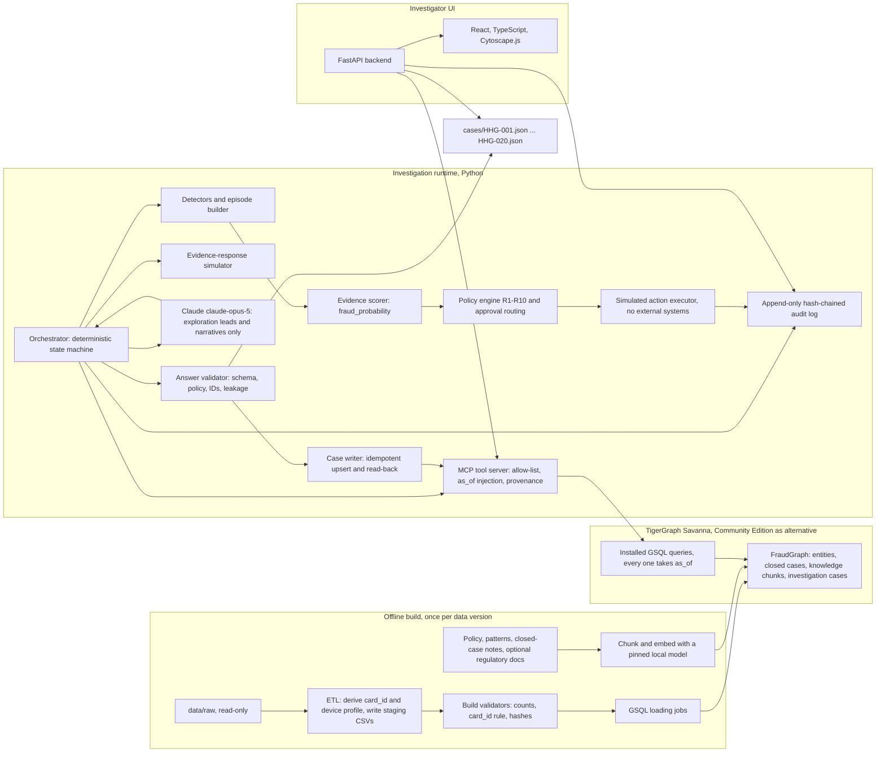
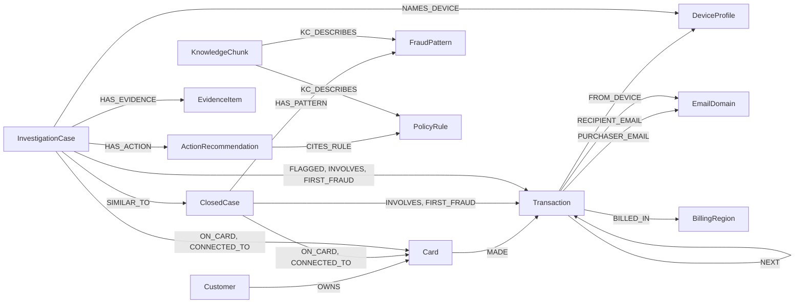
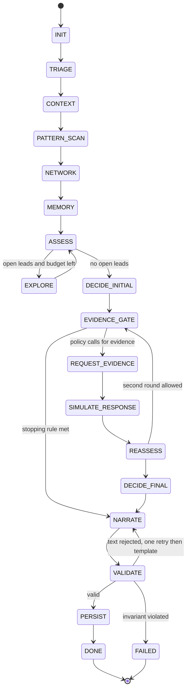
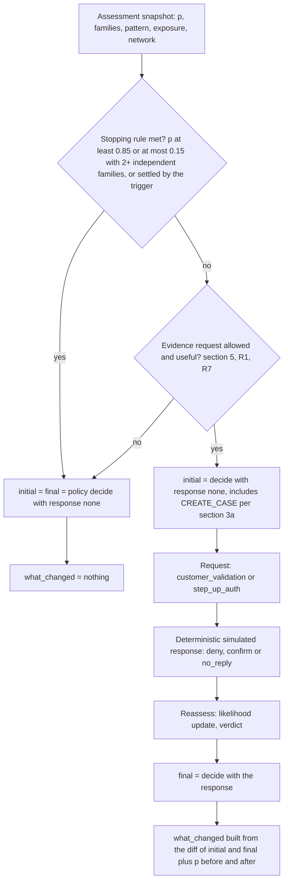
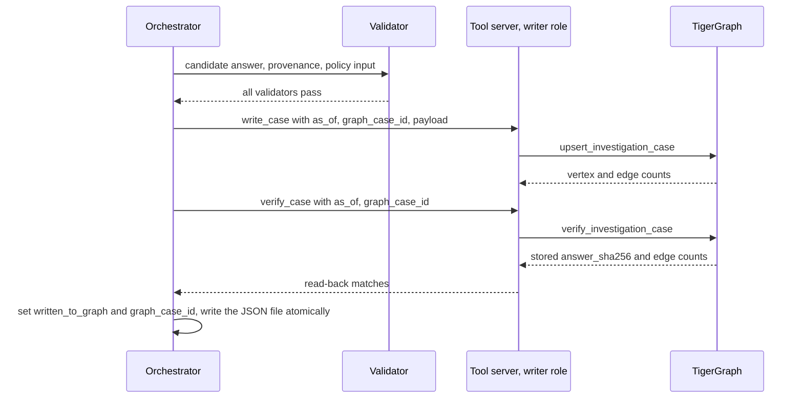

# ARCHITECTURE: TigerGraph × HHGoa 2026 Agentic Fraud Investigation

| | |
|---|---|
| **Phase** | 2: Design only (no implementation code, no cases, no generated outputs) |
| **Date** | 2026-09-24 |
| **Inputs** | `data/raw/README.md` (authoritative), `DATASET_NOTES.md` (Phase 1, conditionally approved) |
| **Status** | Awaiting mentor review |
| **Consistency check** | `python scripts/check_architecture.py` validates this document against the README |

Conventions:
- **[README]** marks a requirement quoted or condensed from the dataset README.
- **[DN §n]** points to `DATASET_NOTES.md`.
- **[OP]** marks an *operational definition*: a concrete threshold or procedure this design adds where the README is silent. Every [OP] value lives in versioned config (Appendix B), is cited in action reasons, and is tuned **only on closed-case history (July–October)**, never on the 20 benchmark cases.

### Mandatory decisions and where they are enforced

| Decision | Enforced in |
|---|---|
| `as_of = case_pack.opened_at` | §4 (T1), §9 (INIT) |
| Every graph query requires `as_of` | §5 (every query's first parameter), §7 (the tool server injects it; the LLM cannot set it), checked by `check_architecture.py` |
| No future transactions, identity rows, or aggregates derived from future data | §2 (no precomputed aggregate attributes), §4 (T1–T9), §5, §18 (leakage tests) |
| K-number card IDs are opaque labels | §3, §4 (T6) |
| The inferred `card_id` rule is a documented, derived rule, validated against labelled pairs | §3 |
| `fraud_probability` is a number from 0 to 1 | §10.3, §11 (schema `minimum 0`, `maximum 1`) |
| No invented merchant IDs | §11 (validator), §15 (SAR subjects) |
| README rules R1–R10 are the decision authority | §10 |
| The LLM never overrides policy, timestamps, permissions or graph facts | §7.4, §9.3, §10.1 |
| Savanna preferred; Community Edition as the alternative | §1.2 |
| Regulatory references are optional and non-blocking | §8.2 |

### Execution plan (compressed, time-critical; replaces the Appendix A phase plan)

| Phase | Scope | Exit criteria |
|---|---|---|
| **1. Minimum working system** | Savanna target; derived `card_id` with validation; essential schema and loading pipeline; the highest-value queries only; **official `tigergraph-mcp` in the agent tool path**; deterministic policy engine R1–R10; GraphRAG over README policy and pattern sections plus closed-case memory; minimal Streamlit UI; `--llm off` mode; temporal-safety and provenance checks kept | One benchmark case runs end to end on Savanna: answer file, graph write and read-back all verified |
| **2. Benchmark completion** | All 20 cases; exactly `cases/HHG-001.json` … `HHG-020.json`; every case written to TigerGraph and read back; JSON, ID, `as_of`, policy, SAR, route and persistence validation | Every validator green on all 20; blockers fixed |
| **3. Submission package** | README setup, demo flow and recording, technical blog, social-post drafts, submission checklist matching the form fields | Package complete |

**Phase 1 implementation deltas** (this narrows the full design; the full design stays as the target):
- **Tool path:** orchestrator → `hhg` gateway (allow-list, server-side `as_of` injection, known-entity check, provenance envelope, **post-check that every returned row has `ts ≤ as_of` / `closed_at ≤ as_of`**) → MCP client (stdio) → **official `tigergraph-mcp`** → Savanna.
  - Reads use `tigergraph__run_installed_query`.
  - Case writes use `tigergraph__add_nodes` / `tigergraph__add_edges` after the installed `delete_case_edges`; read-back uses `verify_investigation_case`.
  - Schema creation, loading and query installation are build steps run with `pyTigerGraph`; they are not agent tools.
- **Queries implemented:** Q01 `get_transaction`, Q04 `customer_cards`, Q14 `shared_origin_scan`, Q15 `shared_device_components`, Q17 `case_history`, Q19 `related_cases_structural`, Q20 `similar_cases_vector`, Q21 `knowledge_search`, Q24 `verify_investigation_case`, Q25 `load_verification_counts`, Q27 `card_history`, Q28 `delete_case_edges`.
  - Q27 returns the card's visible transactions with their device, region and email context. The detectors for Q02, Q03 and Q05–Q10 then run in Python over those graph-returned rows.
  - The remaining catalog queries are deferred until coverage requires them.
- **Scorer:** fixed, documented evidence weights (Appendix B style, [OP]), with no fitting in Phase 1. The closed-case backtest and calibration run in Phase 2 only if time allows. Any weight change is versioned.
- **Embeddings:** a deterministic hashed TF-IDF vector (256-d, numpy), stored as `LIST<DOUBLE>`, with brute-force cosine in GSQL (the §8.5 fallback). This is a lexical embedding, honestly labelled; native vector attributes are optional later.
- **Knowledge corpus:** README Fraud Policy and pattern sections only. Regulatory documents are deferred until the benchmark works.
- **UI:** a single Streamlit page over the run outputs (trigger, status, entities, evidence, patterns, uncertainty, requests, actions, routes, explanation, audit trail).
- **LLM:** `--llm off` (deterministic templates) only in Phase 1; `tokens = 0`.
- **Transaction attributes:** Phase 1 loads only the attributes the detectors use: amount, time, product, channel, risk score, card4/card6, region, emails, `dist1`, `M1`–`M9`, and the readable identity fields. `C*`, `D*`, `V*` and the numeric `id_*` ratings are deferred.
- **Counting and timing:** `tool_calls` counts the investigation's graph and retrieval reads through the gateway. The persistence writes and the read-back are logged separately in the audit log. `latency_s` is measured up to answer assembly, before persistence.
- **Superseding:** graph case IDs are deterministic for fixed versions, so Phase 1 re-runs upsert in place. Marking older-version vertices as superseded is deferred.

---

## 1. System architecture

### 1.1 Component diagram



### 1.2 Deployment

| Concern | Choice |
|---|---|
| Graph database | **TigerGraph Savanna** workspace (preferred) running TigerGraph ≥ 4.2, so native vector attributes are available. Stop the workspace when idle [README]. **Alternative:** Community Edition via Docker Desktop with WSL2 on this Windows host. That route needs Docker or a WSL distribution to be installed first (neither is present today), and about 8 GB of free RAM (free RAM measured at about 2 GB during Phase 1). |
| Graph client | `pyTigerGraph` (REST++ for installed queries and upserts, GSQL for DDL and loading jobs) |
| Tool layer | Project MCP server (Python `mcp` SDK, stdio transport) in front of the installed queries (§7). The official `tigergraph-mcp` server is used by developers and admins for schema inspection, not by the investigating agent (§7.1) |
| LLM | Anthropic Claude via the official `anthropic` Python SDK. Model `claude-opus-5`, adaptive thinking, effort set in config, and server-side refusal fallbacks enabled (§9.3) |
| Embeddings | A pinned local open model (`bge-small-en-v1.5`, 384-d, or an equivalent), deterministic and offline. The model name and SHA are recorded in the graph's `DatasetMeta` vertex |
| Backend and UI | FastAPI + React (Vite, TypeScript) + Cytoscape.js. Streamlit is the fallback if time runs short |
| Secrets | `.env` (git-ignored): `TG_HOST`, `TG_GRAPH`, `TG_SECRET`/token, `ANTHROPIC_API_KEY`. Never logged |
| Runtime | Python 3.11; dependencies pinned in `requirements.txt` |

### 1.3 Division of responsibility

| Deterministic, tested code (decides) | LLM (explains, proposes) |
|---|---|
| Temporal filtering, `card_id` derivation, detectors, episode (affected transactions, first suspicious, exposure), `fraud_probability`, pattern classification, stopping rule, evidence-request decision, simulated responses, policy actions, approval routes, SAR yes/no, status, IDs, case writes, answer assembly | Proposing extra *leads* to check (e.g. "also inspect device profile X"), within a tool budget; wording of `summary`, `pattern_description`, `what_changed`, `stop_reason` and the SAR `narrative`. Every piece of LLM text is validated against the facts (§9.3) and replaced by a deterministic template if it fails |

---

## 2. TigerGraph vertex and edge schema

Graph name: `FraudGraph`. This follows the README's suggested schema [README] and adds only what the evidence, memory and audit need.

**Design rules**
- **S1. No stored aggregates computed over all time.** Degree counts, first/last-seen timestamps, per-card totals and "home region" are *not* stored as attributes; all of them would include future data (T4/T5). Every aggregate is computed at query time over `ts ≤ as_of`.
- **S2. Missing values.** TigerGraph attributes cannot be null. Missing strings are `""`. Missing numbers use the sentinel `-999999.0`, which is safe because the smallest real value observed is −660 (`id_14`) [DN §3]. The loader tests the sentinel never collides with real data, and GSQL helpers treat it as missing.
- **S3. Keys are strings.** `TransactionID` is stored as a 7-digit string and `addr1` as its literal text (`"444.0"`) [DN §3].
- **S4. Directed edges with reverse edges** (`WITH REVERSE_EDGE="rev_<NAME>"`) wherever a query walks the edge backwards.

### 2.1 Vertices

| Vertex | Primary key | Attributes (type) | Source | Expected count |
|---|---|---|---|---:|
| `Customer` | `customer_id` STRING | none | `transactions.customer_id` | 13,553 |
| `Card` | `card_id` STRING (opaque) | `card6` STRING (the derivation key), `derivation_rule` STRING (`card6-rank-v1`) | Derived (§3) | 14,317 |
| `Transaction` | `txn_id` STRING | `ts` DATETIME, `ts_epoch` INT, `amt` DOUBLE, `product_cd`, `channel`, `card2`–`card5`, `card6`, `addr1`, `addr2`, `P_emaildomain`, `R_emaildomain` STRING, `risk_score` DOUBLE, `dist1`, `dist2`, `C1`–`C14`, `D1`–`D15` DOUBLE (sentinel), `M1`–`M9` STRING, `has_identity` BOOL, identity fields (`id_01`–`id_38`, `DeviceType`, `DeviceInfo`) typed as in `reports/data_dictionary.md`. **`V1`–`V339` are not loaded in v1** (§6.3) | `transactions.csv` + `identity.csv` | 590,742 |
| `DeviceProfile` | `profile_key` STRING (canonical, §2.3) | `device_info`, `os`, `browser`, `screen` STRING, `completeness` INT (0–4 known parts) | `identity.csv` | 9,705 |
| `EmailDomain` | `domain` STRING | none | `P_emaildomain` ∪ `R_emaildomain` | 60 |
| `BillingRegion` | `addr1` STRING | none | `addr1` | 332 |
| `ClosedCase` | `case_id` STRING | `customer_id`, `card_id` STRING, `opened_at`, `closed_at` DATETIME, `outcome`, `pattern` STRING, `n_txns` INT, `exposure_usd` DOUBLE, `actions_taken` LIST<STRING>, `report_filed` BOOL, `analyst_notes` STRING, `embedding` VECTOR(384) | `closed_cases_history.csv` | 5,565 |
| `InvestigationCase` | `graph_case_id` STRING (§16) | `case_id`, `run_id` STRING, `as_of` DATETIME, `status`, `verdict` STRING, `fraud_probability` DOUBLE, `pattern`, `pattern_description`, `summary` STRING, `exposure_usd` DOUBLE, `sar_file` BOOL, `answer_json` STRING, `answer_sha256`, `policy_version`, `scorer_version`, `data_manifest_sha256` STRING, `superseded` BOOL, `simulated` BOOL (always true), `created_wall` DATETIME, `embedding` VECTOR(384) | Agent output | 0 at load |
| `EvidenceItem` | `evidence_id` STRING | `claim`, `source`, `ref` STRING, `ordinal` INT | Agent output | 0 at load |
| `ActionRecommendation` | `action_rec_id` STRING | `phase` (`initial`/`final`), `ordinal` INT, `action`, `route`, `reason` STRING, `execution` (`simulated_executed`/`pending_approval`/`approved_simulated`/`rejected`) | Agent output | 0 at load |
| `KnowledgeChunk` | `chunk_id` STRING | `source` (`policy`/`pattern`/`readme`/`regulatory`), `section`, `text`, `url` STRING, `retrieved_at` DATETIME, `sha256` STRING, `embedding` VECTOR(384) | README + optional regulatory documents | ≈ 60 README chunks (+ regulatory) |
| `PolicyRule` | `rule_id` STRING | `title`, `text` STRING | README Fraud Policy: `R1`–`R10`, `§3a`, `§3b`, `§4`, `§5`, `§6`, `§7` | 16 |
| `FraudPattern` | `name` STRING | `description` STRING | README pattern enum | 7 |
| `DatasetMeta` | `meta_id` STRING | `raw_manifest_sha256`, `card_rule_version`, `embedding_model`, `schema_version`, `loaded_at` STRING | Build | 1 |

### 2.2 Edges

| Edge | From | To | Attributes | Expected count |
|---|---|---|---|---:|
| `OWNS` | `Customer` | `Card` | none | 14,317 |
| `MADE` | `Card` | `Transaction` | none | 590,742 |
| `FROM_DEVICE` | `Transaction` | `DeviceProfile` | `new_found` (`id_15`), `proxy` (`id_23`), `match_status` (`id_34`), `device_type` | 140,784 |
| `PURCHASER_EMAIL` | `Transaction` | `EmailDomain` | none | 496,262 |
| `RECIPIENT_EMAIL` | `Transaction` | `EmailDomain` | none | 137,453 |
| `BILLED_IN` | `Transaction` | `BillingRegion` | `addr2` STRING | 525,003 |
| `NEXT` | `Transaction` | `Transaction` | `gap_seconds` INT | 576,425 |
| `INVOLVES` | `ClosedCase` \| `InvestigationCase` | `Transaction` | none | 14,955 at load |
| `ON_CARD` | `ClosedCase` \| `InvestigationCase` | `Card` | none | 5,565 at load |
| `CONNECTED_TO` | `ClosedCase` \| `InvestigationCase` | `Card` | none | 92 at load |
| `FIRST_FRAUD` | `ClosedCase` \| `InvestigationCase` | `Transaction` | none | 4,665 at load |
| `HAS_PATTERN` | `ClosedCase` \| `InvestigationCase` | `FraudPattern` | none | 5,565 at load |
| `FLAGGED` | `InvestigationCase` | `Transaction` | none | 0 at load |
| `NAMES_DEVICE` | `InvestigationCase` | `DeviceProfile` | none | 0 at load |
| `SIMILAR_TO` | `InvestigationCase` | `ClosedCase` \| `InvestigationCase` | `score` DOUBLE, `method` STRING | 0 at load |
| `HAS_EVIDENCE` | `InvestigationCase` | `EvidenceItem` | none | 0 at load |
| `EVIDENCE_ABOUT` | `EvidenceItem` | `Transaction` \| `Card` \| `Customer` \| `DeviceProfile` \| `BillingRegion` \| `EmailDomain` \| `ClosedCase` \| `InvestigationCase` | none | 0 at load |
| `HAS_ACTION` | `InvestigationCase` | `ActionRecommendation` | none | 0 at load |
| `CITES_RULE` | `ActionRecommendation` | `PolicyRule` | none | 0 at load |
| `SUPERSEDES` | `InvestigationCase` | `InvestigationCase` | none | 0 at load |
| `KC_DESCRIBES` | `KnowledgeChunk` | `PolicyRule` \| `FraudPattern` | none | ≈ 60 (named to avoid the Savanna workspace's global `DESCRIBES` edge type) |

Notes:
- `NEXT` is ordered by `(ts, TransactionID)` within a card [DN §5]. Because it crosses the `as_of` boundary, every traversal re-checks `ts ≤ as_of` on the target (T4).
- `ClosedCase` → `Card` edges come from `card_id`, and `CONNECTED_TO` from `connected_card_ids`. All targets exist under the derived rule [DN §4].
- Edges that connect several vertex-type pairs use TigerGraph's multi-pair edge declarations (`FROM A, TO B | FROM C, TO D`).
- Expected counts were computed from the raw data during design. The loader re-derives them, and load verification (§6.4) must match them exactly.

### 2.3 Canonical device-profile key

`profile_key = DeviceInfo + " | " + id_30 + " | " + id_31 + " | " + id_33`. Each missing part is rendered as `?`, and the key is trimmed and case-preserving. This is the README example's format [README] (question Q5 is still open, §20).

Handling:
- An all-blank tuple (3,648 identity rows) produces **no** `DeviceProfile` and no `FROM_DEVICE` edge. `has_identity` stays true on the transaction.
- 21,932 identity rows have a blank `DeviceInfo` but other parts present. They get a low-`completeness` profile, and network queries weight specificity by `completeness` and by windowed degree (§5, hub caps).
- `connected_device_profiles` in answers use exactly this string.

### 2.4 Schema overview



---

## 3. Derived `card_id` strategy and validation plan

**Rule** (`card6-rank-v1`, [DN §4], **derived, not stated in the README**): `card_id = customer_id + "-K" + n`, where `n` is the 1-based rank of the transaction's `card6` value among the **distinct `card6` values of that customer across the full dataset**, sorted lexically with blank (`""`) first.

**Why the full dataset.** The official IDs in `closed_cases_history.csv` and `case_pack.csv` are defined this way. Answers must use IDs that "exist in this dataset" [README], so the derived IDs must reproduce the official ones.

**Temporal consequence.** The numbering encodes future cards: at 2016-11-12, 225 customers' K-numbers would differ if derived from visible data only [DN §7]. The ID string is therefore an **opaque label**:
- No code, prompt, detector or LLM text may reason from the K-number ("K2 exists, so there are two cards"). A lint check in §18 enforces this.
- A card is *visible* at `as_of` only if it has a visible transaction (T6). The number of cards a customer holds is counted from visible cards only.
- Only the `card6` value (credit/debit/…) is used as a card attribute. It is a property of the card, not of time.

**Validation plan**

| # | Check | When | Pass condition |
|---|---|---|---|
| CV1 | Reproduce every labelled pair: all closed-case (transaction, card) pairs plus the 20 case-pack flagged pairs | ETL (build gate) and `validate_dataset.py` | 14,975 / 14,975 (100%). **Any miss aborts the load** |
| CV2 | Every `closed_cases.card_id`, every `connected_card_ids` entry and every case-pack `card_id` exists as a derived card | ETL gate | 0 missing |
| CV3 | Derived IDs are stable across reruns (deterministic sort, no locale dependence) | Unit test | Byte-identical output |
| CV4 | Unverified ordering (`debit` vs `debit or credit`, 2 customers; `charge card` vs `credit`, 1 customer) is listed in the build report, and any answer that names such a card gets a validator warning | ETL + answer validator | Reported, not silently accepted |
| CV5 | Discord confirmation requested (Q1). If the organisers publish a different rule, a new `card_rule_version` is built and diffed | Manual | Recorded in `DatasetMeta` |

---

## 4. `as_of` filtering and temporal-safety rules

**Definition:** `as_of = case_pack.opened_at` for benchmark cases (mandatory). For closed-case backtests (§18), `as_of = closed_case.opened_at`.

| # | Rule | Enforcement point |
|---|---|---|
| T1 | A transaction, its identity fields and its `risk_score` are visible only if `ts ≤ as_of` | Every GSQL query has `as_of DATETIME` as its first parameter and filters `t.ts <= as_of` at every hop that reaches a `Transaction`. There is no unfiltered variant |
| T2 | A `ClosedCase` is visible only if `closed_at ≤ as_of` | Every query that reaches a `ClosedCase` filters on `closed_at` |
| T3 | An `InvestigationCase` is visible only if its `as_of` < the current `as_of`, it is not `superseded`, and its `case_id` differs from the current case. Its content was built only from data visible at its own `as_of` | Query filter; the writer stores `as_of`; the validator proves every entity in a stored case satisfies its own `as_of` |
| T4 | Aggregates (baselines, home region, known devices, "device new to card", counts, sequences, `NEXT` walks) are computed only from visible rows | No aggregate attributes (S1); computed in-query |
| T5 | Graph algorithms (WCC, Jaccard similarity, degree) run on the `as_of`-filtered projection | `shared_device_components` and `card_similarity` are as_of-filtered adaptations of the GDS library algorithms; precomputed global results are forbidden |
| T6 | A card or customer exists for the investigation only if it has a visible transaction. K-numbers are opaque | Queries return only cards with a visible transaction; lint check |
| T7 | Unnamed features (`C*`, `D*`, `M*`, `id_*`) are read only from visible transactions, and evidence describes them as unnamed | Query filter + claim templates |
| T8 | Simulated responses are functions of pre-response, visible evidence only | Simulator input is the frozen assessment snapshot (§13) |
| T9 | Leakage tests: for each query, a fixture transaction at `as_of + 1 s` must never appear | §18.2 |
| T10 | Wall-clock time never enters a decision. Only `created_wall` and `latency_s` use it | Code review + tests |
| T11 | Tool calls from the LLM cannot pass `as_of`, and cannot name entities it has not already seen in this case's tool results | Tool server (§7.3) |
| T12 | Benchmark cases run in `as_of` order (HHG-017 … HHG-004 [DN §12]), so earlier agent cases are legitimately available as memory. Re-running one case alone yields the same answer, because T3 filters by `as_of`, not by run order | Batch runner |

**Regulatory and policy documents** are reference material outside the simulated timeline. Some regulatory documents post-date 2016; they are used only for *how to write and justify*, never as facts about the case. `knowledge_search` still takes `as_of` (for uniformity and audit) but does not filter documents by it.

---

## 5. GSQL query catalog

Every query is an **installed** GSQL query in `gsql/queries/`, and its first parameter is `as_of DATETIME` (mandatory). Queries return JSON with a `visible_ids` list that the tool layer records as provenance. Window parameters are clamped server-side to `[as_of − max_window, as_of]`.

| ID | Query | Inputs | Output | Used by |
|---|---|---|---|---|
| Q01 | `get_transaction` | `as_of DATETIME, txn_id STRING` | Transaction attributes, card, customer, device profile, region, emails; `NOT_VISIBLE` error if `ts > as_of` | TRIAGE |
| Q02 | `card_profile` | `as_of DATETIME, card_id STRING, lookback_days INT` | Visible count, amount median/MAD/p95, product mix, channel mix, region histogram, device profiles seen, email domains, first/last visible ts | CONTEXT, F1/F2/F5 |
| Q03 | `card_window` | `as_of DATETIME, card_id STRING, start_ts DATETIME, end_ts DATETIME` | Transactions ordered by `(ts, txn_id)` in a window clamped to `as_of` | CONTEXT, episode builder |
| Q04 | `customer_cards` | `as_of DATETIME, customer_id STRING` | Visible cards with visible transaction counts and `card6` (no K interpretation) | CONTEXT, R10 |
| Q05 | `card_testing_scan` | `as_of DATETIME, card_id STRING, lookback_hours INT, max_small_amt DOUBLE, min_small_count INT, window_minutes INT` | Candidate sequences: small online authorizations within the window, the next larger purchase, and whether a purchase > $100 has posted | PATTERN_SCAN, R5 |
| Q06 | `burst_scan` | `as_of DATETIME, card_id STRING, window_hours INT, lookback_hours INT` | Sliding-window counts and sums of online transactions; the densest window | PATTERN_SCAN, F3 |
| Q07 | `device_context` | `as_of DATETIME, card_id STRING, txn_id STRING` | The transaction's profile, `id_15`, proxy, match status; whether the profile was seen on this card before this transaction; the profile's windowed degree | PATTERN_SCAN, F4 |
| Q08 | `region_context` | `as_of DATETIME, card_id STRING, txn_id STRING, lookback_days INT, concurrent_days INT` | Whether `addr1` is new to the card; home-region mode; home-region activity within ±`concurrent_days` (clamped); consecutive days in the new region | PATTERN_SCAN, F5 |
| Q09 | `account_takeover_signals` | `as_of DATETIME, card_id STRING, txn_id STRING, lookback_days INT` | Channel-mix shift, M-flag deviations from card history, `id_34` changes, purchaser-email changes, device changes | PATTERN_SCAN, F7 |
| Q10 | `recurring_charge_scan` | `as_of DATETIME, card_id STRING, txn_id STRING, lookback_days INT, amount_tolerance_pct DOUBLE` | Earlier transactions with the same `ProductCD`, similar amount and roughly monthly spacing. This approximates R7's "same merchant", because there is no merchant field | PATTERN_SCAN, R7 |
| Q11 | `device_neighbors` | `as_of DATETIME, profile_key STRING, window_days INT, max_degree INT` | Other visible cards and customers on the profile in the window; their visible transactions; visible closed and agent cases on them; `HUB_CAPPED` flag | NETWORK, R6/R9 |
| Q12 | `region_neighbors` | `as_of DATETIME, addr1 STRING, window_days INT, max_cards INT` | Visible cards in the region in the window that carry fraud indicators (visible confirmed closed cases or agent fraud cases) | NETWORK, R6 |
| Q13 | `email_neighbors` | `as_of DATETIME, domain STRING, role STRING, window_days INT, max_degree INT` | Cards sharing the purchaser or recipient domain in the window with fraud indicators; `HUB_CAPPED` for common domains | NETWORK, R6 |
| Q14 | `shared_origin_scan` | `as_of DATETIME, card_id STRING, window_days INT, max_degree INT` | For each device profile, region and recipient email on the card's recent visible transactions: the count of distinct other cards with fraud indicators in the window, and which cards they are | NETWORK, R6/R9 |
| Q15 | `shared_device_components` | `as_of DATETIME, seed_profile_key STRING, window_days INT, max_degree INT` | Weakly connected component of the card–device bipartite projection restricted to the window (WCC adapted from the GDS library): its cards, profiles and customers | NETWORK, R9, `analyst_request` |
| Q16 | `card_similarity` | `as_of DATETIME, card_id STRING, window_days INT, top_k INT` | Jaccard similarity of device, region and email neighbourhoods against other visible cards (adapted from the GDS neighbourhood-similarity algorithm) | NETWORK |
| Q17 | `case_history` | `as_of DATETIME, card_id STRING, customer_id STRING` | Visible closed cases (T2) and visible agent cases (T3) on this card or customer, and cases naming them as connected | MEMORY, F9 |
| Q18 | `get_closed_cases` | `as_of DATETIME, case_ids SET<STRING>` | Closed-case details, returned only if `closed_at ≤ as_of` | MEMORY |
| Q19 | `related_cases_structural` | `as_of DATETIME, txn_ids SET<STRING>, window_days INT, top_k INT` | Visible cases whose transactions share device profiles, regions or cards with the current episode, ranked by overlap | MEMORY |
| Q20 | `similar_cases_vector` | `as_of DATETIME, query_vec LIST<DOUBLE>, top_k INT, pattern_filter STRING` | Vector top-k over `ClosedCase` and `InvestigationCase` embeddings, with T2/T3 filters applied **inside** the search | MEMORY |
| Q21 | `knowledge_search` | `as_of DATETIME, query_vec LIST<DOUBLE>, top_k INT, sources SET<STRING>` | Top-k `KnowledgeChunk` with section and URL (documents are not time-filtered, §4) | NARRATE, SAR |
| Q22 | `case_subgraph` | `as_of DATETIME, seed_ids SET<STRING>, hops INT, max_nodes INT` | Visible nodes and edges around the case, for the UI | UI only |
| Q23 | `upsert_investigation_case` | `as_of DATETIME, graph_case_id STRING, payload STRING` | Upserts the case vertex, deletes its old outgoing edges and inserts new ones; returns counts | Case writer only |
| Q24 | `verify_investigation_case` | `as_of DATETIME, graph_case_id STRING` | Stored `answer_sha256`, attributes and edge counts, for read-back | Case writer only |
| Q25 | `load_verification_counts` | `as_of DATETIME` | Vertex and edge counts restricted to `as_of` (with `as_of = 2016-12-31 23:59:59` these equal the full counts) | Build verification |
| Q26 | `leakage_probe` | `as_of DATETIME, card_id STRING` | Count of rows with `ts > as_of` reachable from any tool query's traversal pattern (must be 0) | Tests only |
| Q27 | `card_history` | `as_of DATETIME, card_id STRING, lookback_days INT` | The card's visible transactions (`ts ≤ as_of`, within the lookback) with attributes, device profile and identity signals, region and email domains; the input to the Python detectors (Phase 1 consolidation of Q02, Q03, Q05–Q10) | CONTEXT, PATTERN_SCAN |
| Q28 | `delete_case_edges` | `as_of DATETIME, graph_case_id STRING` | Deletes the outgoing edges of one `InvestigationCase` before re-insertion (idempotent rewrite); returns the count deleted | Case writer only |

**Hub control.** Some device profiles and regions are heavy hubs: profiles have a median of 2 transactions but a maximum of 6,353; regions a median of 3 but a maximum of 46,339. Network queries therefore:
- restrict to `window_days` ([OP] default 30, matching "this month" in the analyst request);
- cap the windowed degree at `max_degree` ([OP] default 50 cards);
- return `HUB_CAPPED` rather than silently truncating.

A capped hub is never treated as evidence of a shared origin.

**Graph algorithms used** (T5): WCC (Q15) and Jaccard neighbourhood similarity (Q16), each adapted from the TigerGraph GDS library with an `as_of` and window filter; windowed degree (Q07, Q11–Q14). No precomputed centrality or community results are stored.

---

## 6. TigerGraph loading strategy

### 6.1 Pipeline

1. **ETL** (`src/hhg/etl/`, Python and pyarrow, chunked, string-typed reads [DN §3]):
   - reads `data/raw/` read-only and verifies the SHA-256 against `config/raw_dataset_manifest.json`;
   - derives `card_id` (§3) and `profile_key` (§2.3), orders `NEXT` by `(card_id, ts, txn_id)`, and applies sentinels;
   - writes staging CSVs per vertex and edge type to `data/staging/` (git-ignored), split into chunks of at most 50 MB, plus a `staging_manifest.json` (row counts and hashes).
2. **Build gates** (abort on failure): CV1–CV3 pass; staging counts equal the expected counts in §2; no sentinel collision; every case-pack entity is present.
3. **Schema:** `gsql/schema/*.gsql` (DDL with `schema_version`), applied by a schema-change job. It is idempotent: drop and recreate on a *dev* graph, versioned change jobs on the shared workspace.
4. **Loading jobs:** `gsql/loading/*.gsql`, one per staging file type, run through `pyTigerGraph` `runLoadingJobWithFile`, chunk by chunk. The alternative for Savanna is a cloud-storage data source.
5. **Embeddings:** the ETL computes 384-d vectors for `ClosedCase` narratives and README/policy chunks with the pinned model, then upserts them.
6. **Verification** (§6.4) writes `DatasetMeta`.

### 6.2 Idempotency

Loading is an upsert by primary key, so re-running it is safe. Staging is deterministic, so identical inputs give identical files and hashes. `DatasetMeta.raw_manifest_sha256` must equal the pinned manifest before any investigation run starts (a runtime gate).

### 6.3 Columns loaded

All columns except `V1`–`V339` are loaded [DN §2]. The V columns are excluded in v1: 339 × 590,742 doubles is roughly 1.6 GB, and they are not connected evidence. If the scorer is later shown to benefit from specific V columns (backtest, §18), only those are added as attributes, with a schema version bump. Evidence must describe them as unnamed Vesta features [README].

### 6.4 Load verification

`load_verification_counts(as_of = 2016-12-31 23:59:59)` must equal the §2 expected counts. In addition:
- 200 random transactions are compared field by field with the raw CSV;
- all 20 case-pack flagged transactions, cards and customers resolve through `get_transaction`;
- `leakage_probe` returns 0 for 20 random (card, `as_of`) pairs.

---

## 7. TigerGraph MCP / tool-layer design

### 7.1 Choice

The agent talks only to the **project MCP server `hhg-fraud-tools`** (Python `mcp` SDK, stdio). It exposes an allow-list of read tools, each backed by exactly one installed query.

The official `tigergraph-mcp` server is **not** exposed to the agent, because generic graph tools could run arbitrary GSQL and bypass `as_of`. Developers use it for schema inspection and ad-hoc analysis, and the demo shows it for transparency. Whether its installed-query tool can serve as the backend transport will be checked in Phase 3; if it can, it may replace `pyTigerGraph` behind the same gateway.

### 7.2 Tools

| Tool (LLM-facing) | Backing query | LLM may call | Notes |
|---|---|---|---|
| `get_transaction` | `get_transaction` | yes | Visible IDs only |
| `card_profile` | `card_profile` | yes | |
| `card_window` | `card_window` | yes | Window clamped to `as_of` |
| `customer_cards` | `customer_cards` | yes | |
| `card_testing_scan` | `card_testing_scan` | yes | Parameters fixed from config |
| `burst_scan` | `burst_scan` | yes | |
| `device_context` | `device_context` | yes | |
| `region_context` | `region_context` | yes | |
| `account_takeover_signals` | `account_takeover_signals` | yes | |
| `recurring_charge_scan` | `recurring_charge_scan` | yes | |
| `device_neighbors` | `device_neighbors` | yes | Hub-capped |
| `region_neighbors` | `region_neighbors` | yes | Hub-capped |
| `email_neighbors` | `email_neighbors` | yes | Hub-capped |
| `shared_origin_scan` | `shared_origin_scan` | yes | |
| `shared_device_components` | `shared_device_components` | yes | |
| `card_similarity` | `card_similarity` | yes | |
| `case_history` | `case_history` | yes | T2/T3 |
| `get_closed_cases` | `get_closed_cases` | yes | T2 |
| `related_cases_structural` | `related_cases_structural` | yes | |
| `similar_cases` | `similar_cases_vector` | yes | The server embeds query text with the pinned model |
| `knowledge_search` | `knowledge_search` | yes | |
| `case_subgraph` | `case_subgraph` | no | UI backend only |
| `write_case` | `upsert_investigation_case` | no | Orchestrator only, after validation (Phase 1: official MCP `add_nodes`/`add_edges`) |
| `verify_case` | `verify_investigation_case` | no | Orchestrator only |
| `card_history` | `card_history` | yes | Phase 1 consolidated card read |
| `clear_case_edges` | `delete_case_edges` | no | Orchestrator only, before rewriting a case |

### 7.3 Gateway guarantees (enforced server-side)

- **G-as_of:** each MCP session is bound to one case context `{case_id, as_of, run_id}` at start. Tool input schemas **do not contain `as_of`**; the server injects it. Any `as_of`-like argument is rejected.
- **G-entities:** entity-ID arguments must belong to the case's *known-entity set*: IDs from the case pack plus IDs returned by earlier tool results in this case. This stops the LLM probing arbitrary or guessed IDs.
- **G-budget:** at most `max_tool_calls` per case ([OP] default 40: about 18 mandatory calls plus up to 8 LLM-proposed calls, with headroom), and a per-query timeout. The case fails closed (`FAILED` state) rather than running unbounded.
- **G-provenance:** every result is wrapped in an envelope: `call_id`, `tool`, `query`, the full parameters **including the injected `as_of`**, `executed_at` (wall clock), `row_count`, `visible_ids`, `result_sha256`, `graph_version`. Evidence `ref` strings use `query:<name>(<k=v, ...>)#<call_id>`, following the README example [README].
- **G-readonly:** the LLM-callable tools are read-only. Writes run under a separate role credential held only by the case writer.
- **G-counting:** every graph and retrieval call made for a case, whether mandatory or LLM-proposed, increments `tool_calls` [README: "Graph and retrieval calls made for this case"].

### 7.4 How the LLM is prevented from overriding facts

Five mechanisms, together:
1. The LLM receives tool results as data inside the conversation. Closed-case `analyst_notes` and document text are marked untrusted, so instructions inside them are ignored.
2. The LLM's only outputs that reach the answer are *text fields*. Their structured-output schema contains no verdict, probability, action, route, ID list or timestamp field.
3. The narrative validator (§9.3) rejects any ID, amount, date or rule number that is not in the case's fact sheet.
4. The final answer is re-derived by the policy engine from recorded inputs and compared field by field (§11.3, V-POLICY).
5. The LLM has no write tool and no action-execution tool.

---

## 8. GraphRAG and prior-case memory design

### 8.1 Corpus

| Corpus | Vertex | Granularity | Temporal rule |
|---|---|---|---|
| Closed-case memory | `ClosedCase` | One document per case: templated structured summary + `analyst_notes` | T2 (`closed_at ≤ as_of`) |
| Agent case memory | `InvestigationCase` | Summary + evidence claims + pattern | T3 |
| Policy | `KnowledgeChunk` (`policy`) → `PolicyRule` | One chunk per rule and section (`R1`–`R10`, `§3a`, `§3b`, `§4`–`§7`) | Static |
| Patterns | `KnowledgeChunk` (`pattern`) → `FraudPattern` | One chunk per documented pattern + the README "Things to know" | Static |
| Regulatory (optional) | `KnowledgeChunk` (`regulatory`) | About 800-token chunks with URL, retrieval date and SHA-256 | Static, reference only |

### 8.2 Regulatory references (non-blocking)

A later script, `scripts/fetch_regulatory.py` (Phase 6+), downloads the README-listed public URLs into a git-ignored cache, extracts text, and records URL, `retrieved_at` and SHA-256. Failures are logged and skipped; the system works without them.

FinCEN *SAR Narrative Guidance* is the priority document, since the README names it as the standard for `sar.narrative`. The OFAC SDN list is not ingested: the data contains no names, so it has no use.

### 8.3 Retrieval (hybrid, deterministic ranking)

1. **Structural first** (high precision): `case_history` (same card or customer) and `related_cases_structural` (shared device profiles, regions or cards with the episode).
2. **Vector second:** a *case signature* is rendered deterministically from detector outputs, e.g. "online; new device; anonymous proxy; burst 3 in 2 h; amount 6.1× card median; no region change". It is embedded and passed to `similar_cases_vector` (top 20, T2/T3 filtered in-query). No LLM-generated text is used as a query.
3. **Deterministic re-rank:** `score = 0.5·vector_sim + 0.3·feature_overlap + 0.2·graph_proximity` ([OP] weights). Ties are broken by `case_id`.
4. **Memory features:**
   - **F11:** the similarity-weighted fraud share among the top-k, with the prior corrected (§10.3);
   - the pattern vote distribution;
   - for cleared neighbours, the documented clearance reason (travel, new phone, stated intent [DN §10]). This feeds the simulator's confirmation text (§13).
5. **`similar_prior_cases`** holds the top ≤ 5 retrieved `CC-` IDs above a similarity threshold ([OP] 0.35) that contributed to F11 or to the pattern vote. The validator enforces `similar_prior_cases ⊆ retrieved_ids`. Agent `InvestigationCase` neighbours may inform the decision but are listed in evidence, not in `similar_prior_cases`, which the README defines as "Closed-case IDs from `closed_cases_history.csv`".

### 8.4 Knowledge for narration

`knowledge_search` returns the exact rule text and the pattern definitions for the narrator, plus the SAR guidance chunks. Decisions never depend on retrieved text, because the policy engine encodes the rules directly (§10).

### 8.5 Vector fallback

If the workspace's TigerGraph version lacks native vector attributes, embeddings are stored as `LIST<DOUBLE>` and Q20/Q21 compute brute-force cosine in GSQL. The corpus is small (about 5.6k cases and a few hundred chunks), so this stays fast.

---

## 9. Agent state machine

### 9.1 States



| State | Deterministic work | Tool calls | LLM |
|---|---|---|---|
| INIT | Load the case-pack row; set `as_of`; create `run_id`; bind the MCP session; start the audit chain and step counter | none | no |
| TRIAGE | Resolve the flagged transaction, card and customer; parse trigger text (amount and region cross-checked against the graph) | `get_transaction`, `customer_cards` | no |
| CONTEXT | Card baseline and recent window | `card_profile`, `card_window` | no |
| PATTERN_SCAN | Run all detectors | `card_testing_scan`, `burst_scan`, `device_context` (online), `region_context`, `account_takeover_signals`, `recurring_charge_scan` (disputes) | no |
| NETWORK | Shared-origin analysis | `shared_origin_scan`, plus conditionally `device_neighbors`, `region_neighbors`, `email_neighbors`, `shared_device_components` (`analyst_request` or a device ring), `card_similarity` | no |
| MEMORY | Structural and vector retrieval | `case_history`, `related_cases_structural`, `similar_cases` | no |
| ASSESS | Evidence families → `fraud_probability`, pattern, episode, uncertainty; leads list | none | no |
| EXPLORE | Run LLM-proposed leads through the same tools, then re-run ASSESS | ≤ 8 | **yes** (lead proposal) |
| DECIDE_INITIAL | Policy engine → `initial` actions | none | no |
| EVIDENCE_GATE | Stopping rule (§10.5) or evidence request (§13) | none | no |
| REQUEST_EVIDENCE | Record the request (`type`, `asked_after_step`) | none | no |
| SIMULATE_RESPONSE | Deterministic simulator (§13) | none | no |
| REASSESS | Likelihood update, verdict | none | no |
| DECIDE_FINAL | Policy engine → `final` actions, `what_changed` facts | none | no |
| NARRATE | Fact sheet → text fields | `knowledge_search` | **yes** |
| VALIDATE | §11.3 validators | none | no |
| PERSIST | Graph write + read-back (§16), atomic JSON file write | `write_case`, `verify_case` | no |

**`asked_after_step`** is the value of the step counter (1-based state entries in the audit log) when REQUEST_EVIDENCE is entered.

**Evidence rounds:** at most `max_evidence_rounds` ([OP] 2). A second round is used only when the first response is `no_reply` and a different request type (e.g. `step_up_auth`) could settle the question.

### 9.2 Standard tool plan

The mandatory plan runs identically on every run, so the core evidence does not depend on the LLM. EXPLORE can only *add* leads, and every lead is checked by the same deterministic detectors. Replay mode re-uses the recorded leads from the audit log to reproduce an answer exactly.

### 9.3 LLM integration

| Aspect | Design |
|---|---|
| Model | `claude-opus-5` (config `llm.model`). Adaptive thinking; effort [OP] `high` for EXPLORE, `medium` for NARRATE, tuned by measurement |
| Refusal handling | Server-side fallbacks enabled (`fallbacks: "default"` with its beta header); `stop_reason` checked before content is read. A refusal leads to template text and an audit event |
| Tool use | A **manual** loop owned by the orchestrator, used only in EXPLORE. Client tools are generated from the MCP tool list with `strict: true` schemas and parallel calls allowed; results go back in one user turn. `tool_choice: auto` |
| Structured output | NARRATE uses structured outputs (`output_config.format`, JSON schema) with only these fields: `summary`, `pattern_description`, `what_changed`, `stop_reason`, `sar_narrative`, `evidence_phrasing` (optional rewording keyed by evidence ID) |
| Prompt caching | Stable system prompt (role, policy text, output rules) and tool list first; volatile case data last |
| Determinism | Opus 5 exposes no sampling controls. Decisions stay deterministic because the LLM does not make them. LLM text is recorded with `prompt_sha256` and `output_sha256`, and replay mode re-uses the recorded text |
| `tokens` | Per case, the sum over all LLM calls of `usage.input_tokens + usage.cache_creation_input_tokens + usage.cache_read_input_tokens + usage.output_tokens`. The breakdown is kept in the audit log |
| `latency_s` | Wall-clock seconds from INIT to the end of PERSIST |
| Offline mode | `--llm off`: EXPLORE is skipped, NARRATE uses templates, `tokens = 0`. This mode is used for CI and as the fallback |

**Narrative validator (V-TEXT):**
- Every ID-like token (`\d{7}`, `C\d{5}(-K\d+)?`, `CC-\d{4}`, `HHG-\d{3}`), every dollar amount, every date and every rule reference in LLM text must appear in the case's fact sheet.
- Sentence counts: `summary` 2–6, SAR narrative 6–12, `pattern_description` 2–3 [README].
- Forbidden: K-number reasoning, merchant identifiers, invented device IDs, and claims that an action *was executed* on a real system.

---

## 10. Deterministic policy-engine design

### 10.1 Contract

`decide(PolicyInput) -> PolicyDecision` is a pure function with no I/O. Rules are versioned in `config/policy.yaml` (`policy_version: readme-1.0+op-1`).

- **Inputs:** `trigger_type`, `p`, `n_support`, `n_exculpatory`, `conflict`, `verdict`, `pattern`, `exposure`, `response` (`none`/`deny`/`confirm`/`no_reply`), `dispute` (trigger is `customer_report`), `card_testing` + `cleared_over_100`, `recurring_match`, `shared_link` (element, cards), `coordinated_cross_customer`, `confirmed_fraud_cards`, `credentials_compromised`, `case_opened`, `evidence_requested`.
- **Output:** an ordered list of `{action, route, reason, rule_ids}`, plus the rules fired and the guards applied.

The LLM never supplies any of these inputs.

### 10.2 Actions, routes and canonical order

"Order them by what happens first" [README] is implemented as a fixed canonical order.

| Order | Action | Route rule [README §2] | Customer impact [README §1] |
|---:|---|---|---|
| 1 | `ALLOW_TRANSACTION` | `auto` | None |
| 2 | `DECLINE_TRANSACTION` | `L1` | Low |
| 3 | `STEP_UP_AUTH` | `auto` | Low |
| 4 | `VERIFY_WITH_CUSTOMER` | `auto` | Low |
| 5 | `BLOCK_CARD` | `L1` if exposure ≤ $2,500, else `L2` | High |
| 6 | `BLOCK_ALL_CARDS` | `L2` | Very high |
| 7 | `CREATE_CASE` | `auto` | None |
| 8 | `GENERATE_REPORT` | `auto` | None |
| 9 | `FILE_REPORT` | `L2` | None |
| 10 | `MONITOR_CARD` | `auto` | None |
| 11 | `MONITOR_CONNECTED_CARDS` | `auto` | None |
| 12 | `WARN_CUSTOMER` | `auto` | None |
| 13 | `ESCALATE_TO_ANALYST` | `auto` | None |
| 14 | `CLOSE_NO_FRAUD` | `auto` | None |

This reproduces the README example's orderings: initial `DECLINE_TRANSACTION`, `VERIFY_WITH_CUSTOMER`; final `BLOCK_CARD`, `CREATE_CASE`, `FILE_REPORT`, `MONITOR_CONNECTED_CARDS`.

### 10.3 `fraud_probability` (evidence scorer)

**Evidence families.** Each family is computed from visible data and yields a signed strength and an availability flag. Families are grouped so that each is one *independent* piece of evidence (for R1 and §6).

| Family | Signal | Source queries |
|---|---|---|
| F1 | Amount anomaly: robust z of log amount against the card's visible history (needs ≥ 5 visible transactions) | `card_profile` |
| F2 | Product novelty: `ProductCD` never used on the card | `card_profile` |
| F3 | Velocity: online burst (2–4 within 48 h [README pattern 2]) | `burst_scan` |
| F4 | Device novelty: `id_15 = New` and/or profile unseen on the card; proxy | `device_context` |
| F5 | Region novelty: `addr1` unseen on the card, and whether home activity continues (clone) or not (trip) | `region_context` |
| F6 | Card-testing sequence | `card_testing_scan` |
| F7 | Match and credential anomalies (M-flags, `id_34`, email change, channel shift) | `account_takeover_signals` |
| F8 | Network: shared device, region or recipient email with other cards' visible fraud | `shared_origin_scan`, `*_neighbors`, `shared_device_components` |
| F9 | Prior visible fraud on this card or customer | `case_history` |
| F10 | Bank model `risk_score`, used as an input only | `get_transaction` |
| F11 | Memory: similarity-weighted fraud share of retrieved closed cases | `similar_cases`, `related_cases_structural` |
| F12 | Customer statement: dispute at intake, or the simulated deny/confirm/no-reply | trigger, §13 |
| F13 | Recurring-charge match (exculpatory) | `recurring_charge_scan` |
| F14 | Familiarity (exculpatory): known device, home region, typical amount and product | `card_profile`, `device_context`, `region_context` |

**Model.**
- `logit(p) = b0 + Σ w_f·x_f` for F1–F11, F13 and F14. The weights are fitted by L2-regularised logistic regression on closed-case pseudo-alerts (§18.3) using a **temporal split**: train July–August, validate September, test October. The negatives are the 900 cleared cases.
- A second variant adds down-weighted background negatives, i.e. random visible transactions from July–October that are not in any case. It is adopted only if it improves October calibration.
- Monotonicity is sanity-checked: familiarity must never raise `p`. The fitted weights, and each family's contribution for every case, are stored for explanation.
- **Prior correction:** closed cases are 84% fraud (4,665 / 5,565), while the benchmark is "half legitimate" [README]. The intercept is therefore shifted by `logit(0.5) − logit(train_prior)`.
- **Customer statements (F12)** are not learnable from the data, so they are applied as fixed likelihood ratios [OP]: dispute at intake ×3; simulated deny ×9; simulated confirm ×1/19; no reply ×1.5. These values are recorded as assumptions in `evidence_requests` and the audit log.
- **Output:** `p` is clipped to `[0.01, 0.99]` and rounded to 2 decimals, so it is always a number from 0 to 1. The risk score is F10, never `p` itself [README].

**Uncertainty:**
- `n_support` / `n_exculpatory` count the families whose contribution is at least θ ([OP] 0.4 logit) in each direction.
- `conflict` is true when both directions have a family with contribution ≥ θ_strong ([OP] 1.0 logit).
- `coverage` is the fraction of applicable families that had data.
- An 80% interval for `p` comes from bootstrap refits of the scorer (reported only, never used to decide).

### 10.4 Verdict and status

| Condition | Verdict |
|---|---|
| Response `deny` (settles the question [README §6]), or `p ≥ 0.70` with `n_support ≥ 2` | `fraud` |
| Response `confirm`, or `p < 0.30` with `n_exculpatory ≥ 2`, or `p ≤ 0.15` | `legitimate` |
| Otherwise | `uncertain` |

The thresholds 0.70 and 0.30 are the README's own boundaries (R1 and §3a); 0.15 is the stopping bound (§6).

| Final state | `status` |
|---|---|
| `ESCALATE_TO_ANALYST` in `final` | `escalated` |
| Otherwise, verdict `fraud` | `closed_fraud` |
| Otherwise, verdict `legitimate` | `closed_legitimate` |
| Otherwise (uncertain, not escalated) | `open` |

### 10.5 Rule activation (R1–R10 are the authority)

Each rule is a predicate over `PolicyInput` that emits actions tagged with its rule ID. The engine takes the union, applies the guards (§10.6), adds §3a, routes, orders and merges the reasons.

| Rule | Predicate (deterministic) | Emits |
|---|---|---|
| R1 | `n_support ≤ 1` ∧ `p < 0.70` ∧ `response = none` ∧ ¬`dispute` | `VERIFY_WITH_CUSTOMER`, or `STEP_UP_AUTH` if online with F4/F7 support; **forbids** `BLOCK_*` |
| R2 | `response = deny` ∨ (`dispute` ∧ ¬`recurring_match`) | `BLOCK_CARD`, `CREATE_CASE`; plus `FILE_REPORT` if `exposure > 1000` ∨ `shared_link` |
| R3 | `response = confirm` | `CLOSE_NO_FRAUD` (the confirmation is noted in evidence) |
| R4 | `response = no_reply` | `MONITOR_CARD`, `DECLINE_TRANSACTION`; plus `ESCALATE_TO_ANALYST` if `exposure > 500` |
| R5 | `card_testing` (≥ 3 small online authorizations within 60 min, then a larger purchase) | `DECLINE_TRANSACTION`, `STEP_UP_AUTH`; plus `BLOCK_CARD` if `cleared_over_100` |
| R6 | `shared_link` with ≥ `several_cards` [OP 3, including this one] fraud-indicated cards on one element within `window_days` [OP 30] | `CREATE_CASE`, `FILE_REPORT`, `MONITOR_CONNECTED_CARDS`; the reason names the element (profile string, region code or domain) |
| R7 | `dispute` ∧ `recurring_match` | `CREATE_CASE`, `VERIFY_WITH_CUSTOMER`, `WARN_CUSTOMER`; **forbids** `BLOCK_*` |
| R8 | (`verdict = uncertain` ∧ `exposure > 500`) ∨ `conflict` | `ESCALATE_TO_ANALYST` |
| R9 | `pattern = undocumented` ∧ `coordinated_cross_customer` | `CREATE_CASE`, `FILE_REPORT`, `ESCALATE_TO_ANALYST` |
| R10 | Guard only: `BLOCK_ALL_CARDS` allowed iff `confirmed_fraud_cards ≥ 2` ∨ `credentials_compromised` | Replaces `BLOCK_CARD` with `BLOCK_ALL_CARDS` only when allowed and the customer has more than one visible card |
| §3a case | `p ≥ 0.30` ∨ `evidence_requested` ∨ `dispute` | `CREATE_CASE` (initial and final) |
| §3a report | (`verdict = fraud` ∨ `p ≥ 0.70`) ∧ (`exposure > 1000` ∨ `shared_link` ∨ R9) | `FILE_REPORT` |
| §6 stop, fraud side | `p ≥ 0.85` ∧ `n_support ≥ 2`, no response needed | `BLOCK_CARD` (R1 does not apply because there are multiple signals), `CREATE_CASE`; reason cites §6 and R1 |
| Legitimate closure | `verdict = legitimate` ∧ `response ∈ {none, confirm}` | `CLOSE_NO_FRAUD`; if no case was opened: `ALLOW_TRANSACTION`, `GENERATE_REPORT`, `CLOSE_NO_FRAUD` |

### 10.6 Guards (hard invariants, applied after activation; a violation is a bug)

| Guard | Invariant |
|---|---|
| GD1 (R1) | No `BLOCK_*` if `n_support ≤ 1` ∧ `p < 0.70`, unless `response = deny` |
| GD2 (R7) | No `BLOCK_*` when R7 fired |
| GD3 (R10) | `BLOCK_ALL_CARDS` only under the R10 condition |
| GD4 (§3a) | `FILE_REPORT` ⇒ `CREATE_CASE` in the same list, and `FILE_REPORT` only when (confirmed ∨ strongly suspected) ∧ one of the §3a conditions |
| GD5 | Verdict `legitimate` ⇒ no `BLOCK_*`, no `DECLINE_TRANSACTION`, no `FILE_REPORT`; `CLOSE_NO_FRAUD` present |
| GD6 | `ALLOW_TRANSACTION` and `DECLINE_TRANSACTION` never together; `CLOSE_NO_FRAUD` never together with `BLOCK_*` |
| GD7 | Every route equals `route(action, exposure)` (§14) |
| GD8 | No duplicate actions; canonical order |
| GD9 | Every `reason` cites at least one of `R1`–`R10`, `§3a`, `§3b` or `§6`, and names the evidence it rests on (policy §7) |
| GD10 | No evidence requested ⇒ `final == initial` [README] |

---

## 11. Case JSON schema

### 11.1 Schema (JSON Schema draft 2020-12)

The schema mirrors the README Answer Format field for field. Where it is stricter (ID patterns), the constraint follows from "IDs must be the ones in the dataset" [README]. Cross-field rules the README states explicitly are included; the others are semantic validators (§11.3).

<!-- check:case-schema -->
```json
{
  "$schema": "https://json-schema.org/draft/2020-12/schema",
  "$id": "urn:hhgoa-fraud-agent:case-answer:v1",
  "title": "HHGoa 2026 answer file (cases/<case_id>.json)",
  "type": "object",
  "additionalProperties": false,
  "required": ["case_id", "case", "evidence_requests", "next_best_actions", "sar", "stop_reason", "tool_calls", "tokens", "latency_s"],
  "properties": {
    "case_id": {"type": "string", "pattern": "^HHG-(00[1-9]|01[0-9]|020)$"},
    "case": {"$ref": "#/$defs/case"},
    "evidence_requests": {"type": "array", "items": {"$ref": "#/$defs/evidence_request"}},
    "next_best_actions": {"$ref": "#/$defs/next_best_actions"},
    "sar": {"$ref": "#/$defs/sar"},
    "stop_reason": {"type": "string", "minLength": 1},
    "tool_calls": {"type": "integer", "minimum": 0},
    "tokens": {"type": "integer", "minimum": 0},
    "latency_s": {"type": "number", "minimum": 0}
  },
  "allOf": [
    {
      "if": {"properties": {"case": {"properties": {"verdict": {"const": "legitimate"}}}}},
      "then": {"properties": {"sar": {"properties": {"file": {"const": false}}}}}
    }
  ],
  "$defs": {
    "txn_id": {"type": "string", "pattern": "^[0-9]{7}$"},
    "card_id": {"type": "string", "pattern": "^C[0-9]{5}-K[0-9]+$"},
    "closed_case_id": {"type": "string", "pattern": "^CC-[0-9]{4}$"},
    "date": {"type": "string", "pattern": "^2016-(0[7-9]|1[0-2])-(0[1-9]|[12][0-9]|3[01])$"},
    "action": {"enum": ["ALLOW_TRANSACTION", "DECLINE_TRANSACTION", "MONITOR_CARD", "MONITOR_CONNECTED_CARDS", "WARN_CUSTOMER", "VERIFY_WITH_CUSTOMER", "STEP_UP_AUTH", "BLOCK_CARD", "BLOCK_ALL_CARDS", "GENERATE_REPORT", "CREATE_CASE", "FILE_REPORT", "ESCALATE_TO_ANALYST", "CLOSE_NO_FRAUD"]},
    "route": {"enum": ["auto", "L1", "L2"]},
    "pattern": {"enum": ["card_testing", "card_not_present_fraud", "card_not_present_new_device", "out_of_region_use", "account_takeover", "undocumented", "none"]},
    "action_item": {
      "type": "object",
      "additionalProperties": false,
      "required": ["action", "route", "reason"],
      "properties": {
        "action": {"$ref": "#/$defs/action"},
        "route": {"$ref": "#/$defs/route"},
        "reason": {"type": "string", "minLength": 1}
      }
    },
    "evidence_item": {
      "type": "object",
      "additionalProperties": false,
      "required": ["claim", "source", "ref", "entity_ids"],
      "properties": {
        "claim": {"type": "string", "minLength": 1},
        "source": {"enum": ["graph", "document", "customer", "external"]},
        "ref": {"type": "string", "minLength": 1},
        "entity_ids": {"type": "array", "items": {"type": "string", "minLength": 1}}
      }
    },
    "evidence_request": {
      "type": "object",
      "additionalProperties": false,
      "required": ["type", "asked_after_step", "assumed_response"],
      "properties": {
        "type": {"enum": ["customer_validation", "step_up_auth", "analyst_info"]},
        "asked_after_step": {"type": "integer", "minimum": 1},
        "assumed_response": {"type": "string", "minLength": 1}
      }
    },
    "case": {
      "type": "object",
      "additionalProperties": false,
      "required": ["status", "verdict", "fraud_probability", "pattern", "pattern_description", "affected_txn_ids", "first_suspicious_txn_id", "connected_card_ids", "connected_device_profiles", "exposure_usd", "evidence", "similar_prior_cases", "summary", "written_to_graph", "graph_case_id"],
      "properties": {
        "status": {"enum": ["open", "closed_fraud", "closed_legitimate", "escalated"]},
        "verdict": {"enum": ["fraud", "legitimate", "uncertain"]},
        "fraud_probability": {"type": "number", "minimum": 0, "maximum": 1},
        "pattern": {"$ref": "#/$defs/pattern"},
        "pattern_description": {"type": "string"},
        "affected_txn_ids": {"type": "array", "uniqueItems": true, "items": {"$ref": "#/$defs/txn_id"}},
        "first_suspicious_txn_id": {"anyOf": [{"$ref": "#/$defs/txn_id"}, {"const": ""}]},
        "connected_card_ids": {"type": "array", "uniqueItems": true, "items": {"$ref": "#/$defs/card_id"}},
        "connected_device_profiles": {"type": "array", "uniqueItems": true, "items": {"type": "string", "minLength": 1}},
        "exposure_usd": {"type": "number", "minimum": 0},
        "evidence": {"type": "array", "items": {"$ref": "#/$defs/evidence_item"}},
        "similar_prior_cases": {"type": "array", "uniqueItems": true, "items": {"$ref": "#/$defs/closed_case_id"}},
        "summary": {"type": "string", "minLength": 1},
        "written_to_graph": {"type": "boolean"},
        "graph_case_id": {"type": "string"}
      },
      "allOf": [
        {
          "if": {"properties": {"pattern": {"const": "undocumented"}}},
          "then": {"properties": {"pattern_description": {"minLength": 1}}},
          "else": {"properties": {"pattern_description": {"const": ""}}}
        },
        {
          "if": {"properties": {"verdict": {"const": "legitimate"}}},
          "then": {"properties": {"affected_txn_ids": {"maxItems": 0}, "exposure_usd": {"const": 0}}}
        }
      ]
    },
    "sar": {
      "type": "object",
      "additionalProperties": false,
      "required": ["file", "reason", "narrative", "subjects", "total_amount_usd", "activity_dates"],
      "properties": {
        "file": {"type": "boolean"},
        "reason": {"type": "string", "minLength": 1},
        "narrative": {"type": "string"},
        "subjects": {"type": "array", "uniqueItems": true, "items": {"type": "string", "minLength": 1}},
        "total_amount_usd": {"type": "number", "minimum": 0},
        "activity_dates": {"type": "array", "items": {"$ref": "#/$defs/date"}}
      },
      "if": {"properties": {"file": {"const": false}}},
      "then": {"properties": {"narrative": {"const": ""}, "subjects": {"maxItems": 0}, "total_amount_usd": {"const": 0}, "activity_dates": {"maxItems": 0}}},
      "else": {"properties": {"narrative": {"minLength": 1}, "subjects": {"minItems": 1}, "activity_dates": {"minItems": 2, "maxItems": 2}}}
    },
    "next_best_actions": {
      "type": "object",
      "additionalProperties": false,
      "required": ["initial", "final", "what_changed"],
      "properties": {
        "initial": {"type": "array", "items": {"$ref": "#/$defs/action_item"}},
        "final": {"type": "array", "items": {"$ref": "#/$defs/action_item"}},
        "what_changed": {"type": "string", "minLength": 1}
      }
    }
  }
}
```

### 11.2 README example compliance

`check_architecture.py` validates the README's example against this schema. The **only** expected failures are the example's non-dataset transaction ID formats (`T0412877`), in `affected_txn_ids` and `first_suspicious_txn_id` [DN §9]. With the ID patterns relaxed, the example must validate with zero errors, which confirms the structure matches the README.

### 11.3 Semantic validators (run before any file or graph write; a failure blocks the write)

| ID | Check |
|---|---|
| V-IDS | Every transaction, card, customer and closed-case ID exists in the dataset. Every transaction ID has `ts ≤ as_of`. Every card is visible (T6) |
| V-EXPOSURE | `exposure_usd == round(Σ |amt(affected_txn_ids)|, 2)` [README §4]. `sar.total_amount_usd == exposure_usd` when filing |
| V-EPISODE | Verdict `fraud` ⇒ the flagged transaction is in `affected_txn_ids`, and `first_suspicious_txn_id` is the earliest affected transaction by `(ts, txn_id)`. Otherwise `""` when the list is empty |
| V-SAR | `sar.file ⇔ FILE_REPORT ∈ final` [README]. `activity_dates` = the first and last `ts` dates of the affected transactions. Subjects are dataset IDs (customers and cards only; no merchant IDs, §15). Narrative is 6–12 sentences |
| V-NBA | GD1–GD10 hold for both lists. No requests ⇒ `final == initial` and `what_changed == "nothing"` |
| V-POLICY | Re-running `decide()` on the recorded `PolicyInput` reproduces `initial` and `final` exactly |
| V-MEMORY | `similar_prior_cases ⊆ retrieved closed-case IDs (visible, T2)` |
| V-EVIDENCE | Every `ref` resolves to a recorded provenance envelope, trigger, request or knowledge chunk. `entity_ids ⊆` that envelope's `visible_ids` |
| V-TEXT | §9.3 narrative checks |
| V-STATUS | status and verdict mapping per §10.4 |
| V-GRAPH | `written_to_graph` ⇒ read-back `answer_sha256` matches and `graph_case_id` equals the stored vertex ID (§16) |
| V-COUNTS | `tool_calls` equals the envelopes in the audit log; `tokens` equals the summed usage; `latency_s` > 0 |

---

## 12. Initial and final next-best-action flow



**Scenario table** (what the engine produces, not a claim about any benchmark case):

| Situation | Initial | Request → assumed response | Final |
|---|---|---|---|
| Risk trigger, single weak signal, p < 0.70 | `CREATE_CASE` (if p ≥ 0.30 or a request is made), `VERIFY_WITH_CUSTOMER` (R1) | customer_validation → by §13 thresholds | deny: R2 set; confirm: `CREATE_CASE`, `CLOSE_NO_FRAUD` (R3); no reply: `CREATE_CASE`, `DECLINE_TRANSACTION`, `MONITOR_CARD` (+ `ESCALATE_TO_ANALYST` if > $500, R4/R8) |
| Risk trigger, multiple signals, 0.70 ≤ p < 0.85 | `CREATE_CASE`, `VERIFY_WITH_CUSTOMER` (or `STEP_UP_AUTH`) | → deny (p ≥ 0.60) | `BLOCK_CARD`, `CREATE_CASE` (+ `FILE_REPORT` if > $1,000 or shared), `MONITOR_CONNECTED_CARDS` if R6 |
| p ≥ 0.85 with ≥ 2 families (§6 stop) | `BLOCK_CARD`, `CREATE_CASE` (+ §3a report, R6 monitoring) | none | = initial |
| p ≤ 0.15 with ≥ 2 exculpatory families (§6 stop) | `ALLOW_TRANSACTION`, `GENERATE_REPORT`, `CLOSE_NO_FRAUD` | none | = initial |
| Card testing (R5) | `DECLINE_TRANSACTION`, `STEP_UP_AUTH` (+ `BLOCK_CARD` if > $100 cleared), `CREATE_CASE` | Usually none (the sequence confirms it [README]) | = initial |
| Customer dispute, no recurring match (R2) | `BLOCK_CARD`, `CREATE_CASE` (+ `FILE_REPORT` per R2), + `ESCALATE_TO_ANALYST` if conflict (R8) | none (the denial is the trigger) | = initial |
| Customer dispute matching a recurring charge (R7) | `CREATE_CASE`, `VERIFY_WITH_CUSTOMER`, `WARN_CUSTOMER` | customer_validation → confirm (recognises the recurring charge) | `CREATE_CASE`, `WARN_CUSTOMER`, `CLOSE_NO_FRAUD` (R7 + R3) |
| Analyst request / shared device ring (R6/R9) | `CREATE_CASE`, `FILE_REPORT`, `MONITOR_CONNECTED_CARDS`, `ESCALATE_TO_ANALYST` (R9 if undocumented) (+ `BLOCK_CARD` only if supported without single-signal) | Optional customer_validation on the flagged card | + R2 set on deny |

**`what_changed`:** facts come from the diff (actions added or removed, `p` before → after, the response). The LLM phrases it; V-TEXT checks it.

---

## 13. Additional-evidence simulation design

Customer and analyst replies are not provided [README]. The simulator is a **deterministic, documented function of the pre-response assessment only** (T8). It never reads future data or the closed case covering the same activity.

| Step | Rule [OP unless cited] |
|---|---|
| Request type | `customer_validation` by default. `step_up_auth` when the channel is online, F4 or F7 supports fraud, and the trigger is not a customer report. `analyst_info` is supported but disabled by default (no policy rule requires it; enabling it is a config change) |
| Response class | `deny` if `p_pre ≥ 0.60`; `confirm` if `p_pre ≤ 0.40`; `no_reply` otherwise. For step-up: `failed/abandoned` behaves as deny; `passed` as confirm |
| R7 path | The recurring-charge match leads to `confirm` ("Customer recognises the recurring charge") |
| Confirmation reason | Chosen from the documented clearance reasons of retrieved cleared neighbours [DN §10]: region novelty dominant → travel; device novelty dominant → new phone; amount anomaly dominant → stated intent. Otherwise generic |
| Denial text | "Customer states they did not make transaction `<id>`" (+ "and still has the card" for card-not-present or account takeover; + "was not in region `<addr1>`" for out-of-region) |
| Likelihood ratios | deny ×9, confirm ×1/19, no reply ×1.5 (§10.3) |
| Recording | `assumed_response` starts with `"Simulated: "` and states the rule, e.g. `"Simulated: customer denies (pre-response probability 0.72 ≥ 0.60 deny threshold)…"`. The response is also stored as an `EvidenceItem` with `source = customer` and `ref = evidence_request:<n>` [README example] |

**Why this design:**
- It is transparent. A reviewer can recompute every assumption from the case file.
- It is conservative: the band from 0.40 to 0.60 yields `no_reply`, so the ambiguous cases the README anticipates end as `uncertain` with R1/R4/R8 actions.
- It is grounded in memory through the cleared-case reasons.

---

## 14. Approval-routing design

- `route(action, exposure)` is a pure function implementing the README table exactly (§10.2). `BLOCK_CARD` uses the case's `exposure_usd` (the §4 definition): L1 when it is at most $2,500, otherwise L2.
- **Execution semantics** (all simulated): `auto` actions go to the **simulated action executor**, which records `simulated_executed` in the audit log and the graph (`ActionRecommendation.execution`). `L1`/`L2` actions become `pending_approval` items in the UI approval queue.
- **Human approval (simulated):** a UI user with the demo role `L1` or `L2` may approve or reject an item, and the decision is audited. An L1 user cannot approve an L2 item. Approving only changes the record to `approved_simulated`.
- **No real effect is possible.** The executor module has no network clients or integrations, and a unit test asserts that it imports no HTTP or email libraries. Every UI label and audit event says **SIMULATED**.
- **Answer files** record recommended routes only. Approvals made later in the UI never change the answer file; they are audit events.

---

## 15. SAR-generation design

| Element | Design |
|---|---|
| File or not | Deterministic: `FILE_REPORT ∈ final` (from R2, R6, R9 or §3a) ⇒ `file = true`. `reason` cites the firing rule(s) and the condition met (e.g. "R2: exposure $1,240 > $1,000") |
| Fact sheet | Assembled deterministically from the case. **Who:** customer ID, card IDs (own and connected), device profile strings. **What:** pattern and transactions (amount, ts, `ProductCD`, channel). **When:** first and last `ts`. **Where:** `addr1`/`addr2` codes and channel. **How:** detector findings. **Why suspicious:** the rule-cited evidence |
| Narrative | The LLM drafts 6–12 sentences from the fact sheet and the FinCEN guidance chunks (when available). V-TEXT verifies every ID, amount and date; a deterministic template is used if it fails |
| `subjects` | Customer ID(s) and card IDs named in the narrative. **No merchant IDs** (the dataset has none) and **no invented device IDs**. Device profiles appear in the narrative text and `connected_device_profiles`, not in `subjects` (Q7 open) |
| `total_amount_usd` | `exposure_usd` |
| `activity_dates` | `[min(ts).date, max(ts).date]` over `affected_txn_ids`, formatted `YYYY-MM-DD` |
| No filing | `narrative ""`, `subjects []`, `total_amount_usd 0`, `activity_dates []` [README] |
| Honesty | The narrative describes unnamed features as unnamed. Product codes are "product code C", never merchant names. In the UI the SAR is marked "SIMULATED — not filed with any regulator" |

---

## 16. Graph case-write and idempotency design



- **Deterministic ID:** `graph_case_id = "INV-" + case_id + "-" + sha256(case_id | as_of | policy_version | scorer_version | data_manifest_sha256)[:10]`. The same inputs always give the same vertex; a re-run upserts in place.
- **Edge replacement:** `upsert_investigation_case` deletes the vertex's old outgoing edges and inserts the new ones in one query, so no stale edges remain.
- **Versioning:** if the policy or scorer version changes, a new ID is created, and the old vertex gets `superseded = true` and a `SUPERSEDES` edge. T3 excludes superseded cases.
- **Hash coupling:** the vertex stores `answer_json` and `answer_sha256`. The file's SHA-256 must match (V-GRAPH).
  - Because `graph_case_id` and `written_to_graph` sit inside the answer, the hash covers the canonical answer serialisation with `written_to_graph` set to `true`, computed before the write.
  - If the write fails, the file is written with `written_to_graph: false` and `graph_case_id: ""`, and the case is reported as a failure. There is no silent success.
- **Atomic file write:** write to a temp file, `fsync`, rename. Canonical serialisation: UTF-8, README field order, 2-space indent.
- **Case memory:** `INVOLVES`, `ON_CARD`, `CONNECTED_TO`, `NAMES_DEVICE`, `SIMILAR_TO` and `HAS_PATTERN` make the case discoverable by later investigations' structural retrieval. The embedding makes it discoverable by vector retrieval, under T3.

---

## 17. UI design

**Stack:** FastAPI (read-only APIs over the audit log, answer files and the tool server; one approval endpoint that writes simulated audit events only) + React/TypeScript + Cytoscape.js.

```text
┌ Case queue ──────────┐┌ HHG-0xx · as_of 2016-..-.. · [SIMULATED ENVIRONMENT] · future rows hidden: N ┐
│ HHG-017  escalated   ││ Trigger: type, text, flagged txn, risk score (input, not answer)              │
│ HHG-015  closed_...  ││ Progress: INIT ▸ TRIAGE ▸ … ▸ PERSIST (step counter, tool calls, tokens, s)   │
│ …                    │├──────────────────────────────────┬───────────────────────────────────────────┤
│ filter: status/verdict││ Graph (Cytoscape, as_of filtered)│ Uncertainty: p gauge + 80% interval,       │
└──────────────────────┘│ card, customer, txns, devices,   │ family contributions (waterfall),          │
                        │ regions, connected cards, prior  │ support/exculpatory counts, conflict,      │
                        │ cases; click a node → provenance │ stopping-rule status                       │
                        ├──────────────────────────────────┼───────────────────────────────────────────┤
                        │ Evidence: claim · source · ref ·  │ Patterns: detector results, chosen pattern │
                        │ entities; expand → query envelope │ and description, memory vote               │
                        ├──────────────────────────────────┴───────────────────────────────────────────┤
                        │ Evidence requests: question → "Simulated:" assumed response → p before/after │
                        │ Actions: initial vs final diff, route badges auto/L1/L2, rule citations       │
                        │ Approval queue: pending L1/L2 items → approve/reject (simulated, audited)     │
                        │ SAR preview (SIMULATED, not filed) · Summary · what_changed · stop_reason     │
                        │ Audit trail: hash-chained events, verify chain ✓ · Raw JSON · Download        │
                        └──────────────────────────────────────────────────────────────────────────────┘
```

| Required UI element [task brief] | Panel |
|---|---|
| Investigation trigger | Header / Trigger |
| Case status and progression | Case queue + Progress bar (state machine steps) |
| Entities and relationships | Graph panel (`case_subgraph`, as_of-filtered) |
| Evidence collected | Evidence panel with provenance drill-down |
| Detected patterns | Patterns panel |
| Uncertainty and confidence | Uncertainty panel |
| Additional evidence requests | Evidence-requests panel |
| Recommended actions | Actions panel (initial vs final) |
| Approval route | Route badges + approval queue |
| Explanation and audit trail | Summary / what_changed / stop_reason + audit trail with chain verification |

**Innovation features:**
- a **leakage shield** badge showing how many future rows exist but are hidden at `as_of`;
- a **replay** of the state machine step by step from the audit log;
- a **"why this action"** view that re-runs `decide()` in the browser from the recorded `PolicyInput`, showing which rule fired and which guards applied.

---

## 18. Evaluation and test strategy

### 18.1 Unit tests (no network)

- **Policy engine:** table-driven cases for every rule R1–R10, §3a, the §6 stop and guards GD1–GD10; property tests (random `PolicyInput` ⇒ invariants hold); routing boundaries ($2,500.00 vs $2,500.01; $1,000 and $500 edges).
- **Scorer:** determinism, clipping, prior shift, monotonicity of the exculpatory families.
- **Simulator:** threshold boundaries (0.40 / 0.60); text never contains data from after `as_of`.
- **Validators:** each V-rule has a passing and a failing fixture. The schema is tested against valid and invalid documents.
- **Card ID:** CV3 plus a lint check (regex over `src/` and prompts) forbidding K-number parsing outside `etl/card_id.py`.
- **Executor:** imports no network libraries; `L1`/`L2` actions cannot be executed without an approval record.

### 18.2 Integration tests (TigerGraph test graph)

- A small **synthetic fixture graph**, clearly labelled synthetic and never presented as HHGoa data, loaded into `FraudGraphTest`.
- **T9:** for every query, a row at `as_of + 1 s` and a closed case with `closed_at = as_of + 1 s` must not appear; an agent case with `as_of` equal to the current one must not appear.
- Hub caps return `HUB_CAPPED`.
- Idempotent case writes: writing twice gives identical counts and hash.

### 18.3 Backtest on closed cases (the only labels)

Each closed case becomes a pseudo-alert:
- `as_of = opened_at`;
- `flagged` = the latest transaction in `txn_ids`;
- trigger `customer_report` for confirmed fraud ("cardholder reported"), `risk_score` for cleared ("model scored") [DN §10];
- memory excludes the case itself (T2 already guarantees this).

Setup: tune on July–September, report on **October only**, re-weighted to a 50/50 benchmark mix.

| Metric | Target use |
|---|---|
| Verdict accuracy and balanced accuracy | Investigation accuracy |
| Pattern macro-F1 (5 + undocumented + none) | Pattern choice |
| Episode Jaccard vs `txn_ids`; first-transaction accuracy; exposure absolute error | Scope ("how far it goes") |
| Report decision accuracy vs `report_filed` | Case vs case + report |
| Brier score, ECE, reliability plot | Calibration (`fraud_probability` is scored for calibration) |
| Baselines: risk score alone; always-fraud | The agent must beat both |

The trigger-type proxy is a known bias: in history, disputes are almost always fraud, but the benchmark is half legitimate. Metrics are therefore also reported per trigger type, and trigger type is **not** a scorer feature (§10.3).

### 18.4 Benchmark-run checks (20 cases, no labels available)

- **Schema:** all 20 files validate. There are exactly 20 files named `HHG-001.json` … `HHG-020.json`.
- **Semantics:** V-IDS … V-COUNTS all pass.
- **Determinism:** two `--llm off` runs are byte-identical except `latency_s`. Two LLM runs have identical decision fields (`verdict`, `pattern`, `fraud_probability`, `affected_txn_ids`, actions, routes, `sar.file`).
- **Leakage audit:** every referenced entity is visible at its case's `as_of`.
- **Graph:** 20 `InvestigationCase` vertices, hashes matching the files.

### 18.5 Documentation checks (this phase)

`scripts/check_architecture.py`:
- the 20 required sections are present, in order;
- the case schema is valid draft 2020-12 JSON Schema, and its fields and enums equal the README Answer Format and Fraud Policy tables;
- the README example fails only on the documented ID formats, and passes when those are relaxed;
- every query's first input is `as_of DATETIME`;
- every tool maps to a catalogued query;
- every edge endpoint is a declared vertex, and every README-suggested vertex and edge is present;
- the canonical action table matches the README actions and routes;
- the Mermaid blocks are present with known diagram types.

---

## 19. Demo plan

**Video (3–5 min) storyboard.** The cases shown are chosen *after* the Phase 7 run from actual outputs; nothing is staged.

| Time | Segment | On screen |
|---|---|---|
| 0:00–0:25 | Problem: risk scores are wrong in both directions; half the alerts are legitimate | README quote, risk-score histogram of closed cases (cleared 0.81–0.99) |
| 0:25–0:55 | Architecture: TigerGraph as the source of truth, as_of-safe tool layer, deterministic policy, LLM for explanation | §1 diagram |
| 0:55–2:10 | Case walk-through 1 (evidence changes the decision): trigger → graph → evidence → p → initial VERIFY → simulated response → final → routes | UI, leakage-shield badge |
| 2:10–2:55 | Case walk-through 2 (network): shared device profile across cards (Q15 WCC), R6/R9, SAR preview | Graph panel, SAR |
| 2:55–3:25 | A legitimate case correctly closed, with memory of cleared cases | Memory panel |
| 3:25–3:55 | Trust: audit chain verification, simulated approvals (L1 can't approve L2), replay | Audit panel |
| 3:55–4:30 | Evaluation: October backtest metrics vs the risk-score baseline, calibration plot, determinism check | Report |
| 4:30–4:50 | Wrap: repository, README setup, blog link | |

The blog post, social posts (tagging @TigerGraphDB and @247pmstudio) and README setup guide are written in Phase 8 from real results.

---

## 20. Risks and mitigations

| # | Risk | Impact | Mitigation |
|---|---|---|---|
| RK1 | The inferred `card_id` rule differs from the organisers' | Made-up IDs score zero | CV1 build gate at 100%; CV4 warnings; ask on Discord (Q1) |
| RK2 | Temporal leakage through a query, a feature or an embedding | Invalid benchmark | T1–T12, no aggregate attributes, in-query filters, T9 tests, leakage audit |
| RK3 | Vesta features computed using future data (Q6) | Hidden leakage | Features are not central to the scorer; V excluded in v1; ablation in the backtest |
| RK4 | Scorer biased by closed-case selection (cleared cases all high-score alerts; disputes nearly always fraud) | Miscalibrated `p` on a 50/50 benchmark | Prior shift, trigger type excluded, October holdout, reliability plot, background-negative variant |
| RK5 | Simulated responses decide finals | Final actions look pre-determined | Transparent threshold rule, a `no_reply` band, recorded rationale, grounded confirmation reasons; flagged for mentor review |
| RK6 | Operational thresholds ([OP]) differ from the answer key's intent | NBA score | All in config, cited in reasons, tuned only on history; listed for review (Appendix B) |
| RK7 | Policy ambiguities: R1 vs R2 on bare disputes; `CREATE_CASE` in both lists; block at the §6 stop without contact | NBA score | Explicit resolutions in §10.5 and §12; mentor review items M1–M4 |
| RK8 | Savanna quota or version lacks vector support | Blocked GraphRAG | §8.5 brute-force fallback; Community Edition alternative |
| RK9 | Community Edition on this host: no Docker/WSL distribution, about 2 GB free RAM | Local dev blocked | Prefer Savanna; CE only after installing Docker Desktop/WSL and freeing memory |
| RK10 | Hub vertices (regions up to 46k transactions) make network queries slow or noisy | Latency, false links | Window + degree caps, `HUB_CAPPED`, specificity weighting |
| RK11 | LLM hallucinated facts or IDs | Wrong answers, lost trust | Narrow text-only role, V-TEXT, template fallback, replay |
| RK12 | LLM refusals or API outage | Missing text | Server-side fallbacks, `--llm off` template path |
| RK13 | Regulatory URLs unavailable | Weaker SAR grounding | Non-blocking; FinCEN guidance cached when available; template still meets 5W+H |
| RK14 | README example deviates from the policy (e.g. no `CREATE_CASE` in initial, a reason without a rule) | Ambiguity about the key | The policy is the authority (mandated); deviations documented [DN §9] |
| RK15 | Seeded-row artefacts (whole-minute timestamps) exploited | Benchmark gaming | Forbidden as a signal; lint check and scorer feature review |
| RK16 | Graph write partial failure | Inconsistent memory | Single-query upsert, read-back verification, honest `written_to_graph` |
| RK17 | Scope and time pressure | Incomplete demo | Phased plan (Appendix A); Streamlit fallback UI |

**Mentor review items:**

| # | Question |
|---|---|
| M1 | R2 applies to a bare customer dispute (denial at intake) unless R7 matches; R8 adds escalation when evidence conflicts |
| M2 | `CREATE_CASE` appears in `initial` whenever §3a holds (unlike the README example) and is repeated in `final` |
| M3 | At the §6 stop (p ≥ 0.85, ≥ 2 families), `BLOCK_CARD` is recommended without customer contact, citing §6 and R1 |
| M4 | Simulator thresholds 0.60 / 0.40 and a `no_reply` band |
| M5 | SAR `subjects` exclude device profiles (Q7) |
| M6 | Status `escalated` whenever `ESCALATE_TO_ANALYST` is in `final`, including R9 fraud |
| M7 | `similar_prior_cases` holds closed cases only; agent cases are cited in evidence |

---

## Appendix A: Repository layout and phase plan

```text
config/            policy.yaml, scorer.yaml, llm.yaml, raw_dataset_manifest.json
gsql/schema/       DDL (schema_version)
gsql/loading/      loading jobs
gsql/queries/      Q01–Q26 installed queries
src/hhg/etl/       staging build, card_id (the only module that may parse K-numbers), profile keys
src/hhg/graph/     pyTigerGraph client wrapper
src/hhg/tools/     MCP server hhg-fraud-tools (gateway guarantees §7.3)
src/hhg/detectors/ F1–F14 feature extraction, episode builder
src/hhg/scoring/   evidence scorer, calibration
src/hhg/policy/    decide(), route(), guards
src/hhg/simulate/  evidence-response simulator
src/hhg/memory/    retrieval, re-rank, embeddings
src/hhg/agent/     state machine, LLM integration
src/hhg/casefile/  schema, validators, writer
src/hhg/audit/     hash-chained log
src/hhg/api/       FastAPI
ui/                React app
cases/             exactly 20 answer files (Phase 7)
cases_monitoring/  optional autonomous-monitoring cases (Innovation)
docs/              blog, demo script, social posts (Phase 8)
tests/
```

| Phase | Scope | Exit criteria |
|---|---|---|
| 3 | ETL, schema, loading, load verification on Savanna | §6.4 passes |
| 4 | Installed queries Q01–Q26, tool server, T9 tests | Leakage tests green |
| 5 | Detectors, scorer, policy engine, simulator, validators; backtest | October metrics beat the baselines |
| 6 | State machine, LLM integration, case writer, audit log | Full-pipeline tests green, including `--llm off` |
| 7 | 20-case run, graph writes, benchmark checks | §18.4 all green |
| 8 | UI polish, README, video, blog, social posts | Demo recorded |

## Appendix B: Configuration parameters and provenance

| Parameter | Value | Provenance |
|---|---|---|
| case threshold | p ≥ 0.30 | README §3a |
| R1 weak-signal bound | p < 0.70 | README R1 |
| stop bounds | ≥ 0.85 / ≤ 0.15 with ≥ 2 independent families | README §6 |
| BLOCK_CARD L1/L2 split | $2,500 | README §2 |
| report exposure | > $1,000 | README R2, §3a |
| escalation exposure | > $500 | README R4, R8 |
| card testing | ≥ 3 small online auths within 60 min, then a larger purchase; block if > $100 cleared | README R5 |
| small-auth amount | ≤ $5.00 | [OP], from "often under $5" [README pattern 1]; checked against the closed `card_testing` cases |
| CNP burst | 2–4 online within 48 h | README pattern 2 |
| R6/R9 window | 30 days | [OP], from "this month" (HHG-014 trigger text) |
| several cards | ≥ 3 including the current card | [OP] |
| hub degree cap | 50 cards in window | [OP] |
| evidence family thresholds θ / θ_strong | 0.4 / 1.0 logit | [OP] |
| verdict fraud | p ≥ 0.70 and ≥ 2 supporting families, or deny | [OP] from README R1 / §6 |
| verdict legitimate | p < 0.30 with ≥ 2 exculpatory families, or p ≤ 0.15, or confirm | [OP] from README §3a / §6 |
| simulator bands | deny ≥ 0.60, confirm ≤ 0.40, else no reply | [OP] (M4) |
| customer LRs | dispute ×3, deny ×9, confirm ×1/19, no reply ×1.5 | [OP] (assumption, recorded) |
| memory re-rank weights | 0.5 / 0.3 / 0.2; threshold 0.35; top ≤ 5 cited | [OP] |
| tool budget | 40 per case; ≤ 8 LLM leads; ≤ 2 evidence rounds | [OP] |
| recurring charge | same ProductCD, amount ±2%, 25–35 day spacing, ≥ 2 prior occurrences | [OP] approximation of R7 (no merchant field) |

## Appendix C: Open questions carried from DATASET_NOTES §14

| Q | Status after this design |
|---|---|
| Q1 card_id rule | Used as a derived rule with a 100% gate; Discord confirmation pending |
| Q2 cut-off | **Resolved** (mandated): `as_of = opened_at` |
| Q3 timezone | Single naive clock (no time-of-day features depend on the timezone) |
| Q4 November closed cases | Treated as history under T2 |
| Q5 device profile string | `DeviceInfo \| OS \| browser \| screen` with `?`; confirmation pending |
| Q6 Vesta features point-in-time | Unknown; V excluded in v1; ablation |
| Q7 SAR subjects | Customers and cards only (M5) |
| Q8 agent cases as memory | Yes, under T3 |
| Q9 R1/§3a/R6 terms | Defined in §10 and Appendix B [OP] |
| Q10 status after simulation | §10.4 mapping (M6) |
| Q11 tool_calls/tokens/latency | Defined in §7.3 and §9.3 |
| Q12 regulatory documents | Non-blocking cache (§8.2) |
